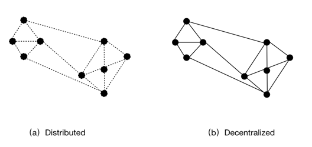

# Soldity Project

## Resuorce
- [Dummies-for-blockchain](https://zhangli1.gitbooks.io/dummies-for-blockchain/content/di-1-zhang-bi-te-bi-3001-qu-kuai-lian-3001-zhi-neng-he-yue/bi-te-bi/yun-gong-shi/fen-bu-shi-xi-tong-yu-qu-zhong-xin-hua.html)

- [Udemy:Create Ethereum & Blockchain Applications Using Solidity](https://www.udemy.com/solidity/learn/v4/questions)

- 

## Backed by Mathematics using Hashing functions miners verify Hash Value

- Miners verify the balidity of a transaction/block.
- Transactions are grouped into block.
- Block is verified and added into the Chain.

```
Block -> Block -> Block
```

#### Blockchain is a decentrialize distributed Database

***

## Centralized vs Decentralized vs Distributed


The primary difference is how/where the “decision” is made and how the information is shared throughout the control nodes in the system.


## Centralized System
All the data is a unified body that is stored on one computer. To get the information you have to connect to the main computer called server.


### Distributed System*
Distributed means that the processing is shared across multiple nodes, but the decisions may still be centralized and use complete system knowledge.

There are no data storages. All the nodes contain information. The clients are equal and have equal rights.

而有先见之明的计算机科学家，早在上世纪70年代开始就已经开始研究多处理器并行技术，到现在分布式系统的百花齐放，特别是Google的三大论文的发表，奠定了分布式系统的架构的大格局，之后该类型应用如雨后春笋般涌现。如，Google File System、MapReduce、Bigtable、Hadoop、Zookeeper、Spark、Storm、Hive、Hbase、Kafka、Redis等等，这些应用无一不是为了解决单一服务器解决不了的大量计算、海量存储、高效通信等问题。

分布式系统由于需要多台“计算机”协同工作，在逻辑处理、资源分配、信息安全以及性能上与我们常见单一计算机有很大的不同，而在这些问题中重要的就是各个节点之间的一致性，如何保证整个集群的一致性（Consistency），是确定一个系统是否是分布式系统的关键。

为此计算机科学家埃瑞克·布鲁尔在1999年提出了CAP原理（Consistency、Availability、Partition tolerance），分布式系统的一致性、可用性以及分区容错性。

- 一致性：分布式系统不同节点的备份数据，在同一时刻值是否相同。
- 可用性：分布式系统良好、高效的响应性能。
- 分区容错性：分布式系统中，若节点出现故障，是否能保证整个系统正常运行的可靠性。


### Decentralized System*
Decentralized means that there is no single point where the decision is made. Every node makes a decision for it’s own behaviour and the resulting system behaviour is the aggregate response.

A key characteristic is that typically no single node will have complete system information.

There is no central storage. Some servers provide information to the clients. The servers are connected with each other.

广义概念：在多个参与者的系统中，不存在特殊权值的个体，信息的采纳由多数个体确认并被集体认可。
狭义概念：在多个节点的系统中，每个节点的数据相同，且系统操作具有强一致性。

### BlockChain(Democratic Network)
No signle aithority controls it and no signle place processes the information.

因此，去中心化是每个个体参与和数据一致性的体现，它的实现可以有效避免任何一个权威性的中心点参与、发布、左右结果，也不用担心信息的伪造、篡改和否认。

#### 去中心化的系统与之前讲述的分布式系统有何不同呢？

其中，关键在于概念以及应用场景的不同，导致对节点数据的状态需求不同。分布式系统的数据副本是分散、分片存储，而去中心化系统的数据是完整副本，因此衍生出不同的系统机制。



如上图可以看出，分布式系统中的连接使用虚线，因为每次请求被执行或分配的节点有限，为了保证有效资源利用，不会使用到所有节点，例如HDFS、Spark等等，同时它们也是串行化器（Serializer）的一种体现。

串行化器实际上是保证节点状态能同步的一种方法，有序的发布命令，让节点之间不易发生冲突。
但是有单点故障问题（Single Point of Failure）。


而去中心化图中的实线代表，每一个请求（Update、Delete等）的执行会波及整个系统的所有节点，如：Zookeeper，又或着是HyperLedger和Ethereum等基于区块链的服务。

实际上去中心化与分布式系统有着相似的主体结构，因此分布式系统的一些概念、特点、特性对于区块链也是适用的，如：一致性、可用性、分区容错性以及CAP原则。

需要注意的是，在广义概念中添加了“共识”的理念；而对于狭义来说，就是保证多个节点之间的一致性。

去中心化和共识是两个不同的概念，两者结合才是真正意义上的“去中心化”，去中心化有了共识才具备了完全的可信度，否则只是狭义概念的数据共享，没人知道这些共享的数据是否真实，或者被集体认可，仅仅只是拥有这些信息；共识有了去中心化，就具备了安全性，系统很难被攻破，信息也难被篡改；再加上特殊的数据结构，而这一切的实现就是区块链。


### DApp
The ethereum white paper splits dapps into three types: apps that manage money, apps where money is involved (but also requires another piece), and apps in the "other" category, which includes voting and governance systems.

First type of app, a user may need to exchange ether as a way to settle a contract with another user, using the network's distributed computer nodes as a way to facilitate the distribution of this data.

Second type of app mixes money with information from outside the blockchain. Ex, a crop insurance application that's dependent on an outside weather feed.

To execute, these smart contracts rely on so-called "oracles" that relay up-to-date information about the outside world. (Though, it's worth noting that some developers are skeptical that this use case can be done in a decentralized way.)

Third, If bitcoin can do away with financial authorities, is it possible to do the same for companies and other types of organizations?

Decentralized autonomous organizations are one particularly ambitious breed of dapp.


***

## Block
- Block Size
- Block Header
- Transaction Counter
- Transactions: Come from Merkle Tree

### Field
- Version
- Previous Block Hash
- Merkle Root Hash 
- Time Stamp
- Difficalty Target 
- NONLE

### How Blocks linked together
- Previous Hash
- Time Stamp
- Random Nonce
- Root Hash
- All Transactions

The way they link together, take the prevous entire hashed block with the next block

### Genesis Block (Statically Created)


***